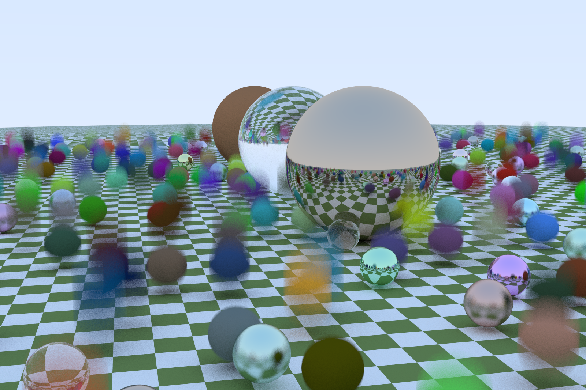

# ray-tracing-cuda

Final Project for Graphics Processing Units (GPUs): Architecture and Programming

**Team Member:** Hanlin He, Yaowei Zong

---

## Introduction

This project explores CUDA programming on GPUs to accelerate a simple ray-tracing algorithm.

The main goal is to use CUDA to accelerate the ray-tracing rendering process, which contains massive computations, thus it's perfect for CUDA programming using the many cores of a GPU.

We also compare the performance of CUDA programming and multi-core openMP/openACC programming.

## Source Code

The main folder contains the single GPU version CUDA code.

    - src: the source code
    - external: external libraries
    - setup.sh: script to set up the CUDA environment

The following sub-folders contain other versions:

    - multi-gpu: multi-GPU CUDA version
    - cpu_openMP: multi-core CPU openMP version
    - openACC: openACC version

## CUDA

The CUDA version uses a single GPU on NYU CIMS CUDA clusters.

### Build

To build the code, run:
```
source setup.sh
```
This will setup the CUDA environment and build the code.

### Run

To run the ray-tracer, `cd` into the build folder and run
```
./cuda_ray_tracing [PR|MQ|HQ|SH]
```

Sample output:



The above image is produced on `cuda2.cims.nyu.edu`, using a single GeForce RTX 2080 Ti GPU, with a compute capability of 7.5.

(image size: 1600x1067, time taken: 8.618s)