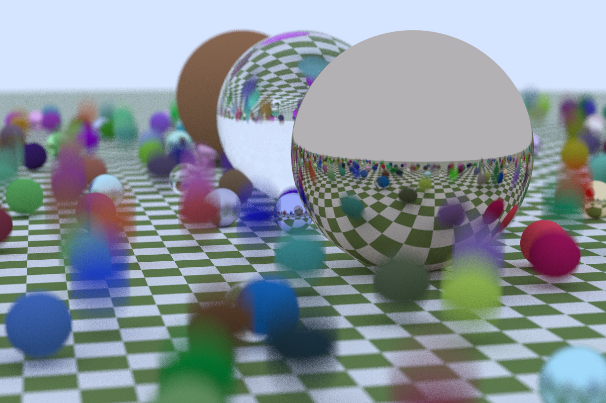

# ray-tracing-cuda

This folder contains the CPU openMP version code.

## Build

To build the code, run
```
source setup.sh
```

This will setup the environment and build the code.

or manually load the modules:
```
module load cmake-3
module load gcc-11.2
```
then
```
cmake -B build
```

## Run

To run the ray-tracer, `cd` into the build folder and run
```
./parallel_ray_tracing <number of threads> [--width] [--sample] [--depth]

# Example:
./parallel_ray_tracing 40 --width=1200 --sample=100 --depth=10
```
the output image will be `raytrace.png`

Sample output:



The above sample takes `8m16.569s` with 40 threads, `--width=1200 --sample=100 --depth=10`.