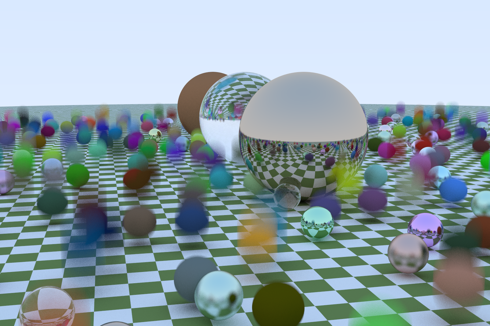

# ray-tracing-cuda

This folder contains the multi-GPU version code for ray-tracing-cuda.

## Build

To build the code, run
```
source setup.sh
```
This will setup the environment and build the code.

## Run

To run the ray-tracer, `cd` into the build folder and run
```
./cuda_ray_tracing [PR|MQ|HQ|SH]
```
the output image will be `raytrace.png`

Sample output:

